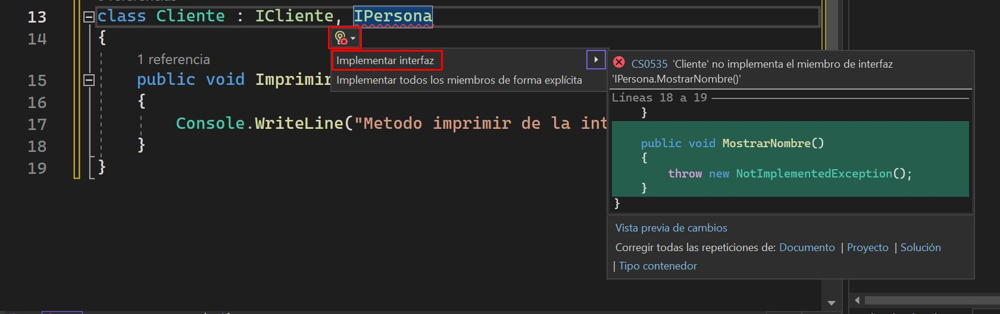
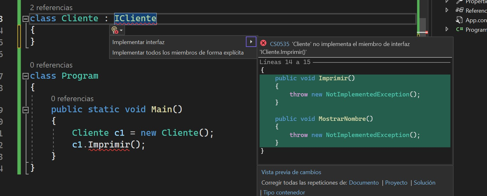

# Contenido

[TOC]

# Parte 30 - Introduccion a las clases en C#

## [Parte 30][1]

Hola bienvenidos yo soy Cristina,
esta es la Parte 30: Introduccion a las interfaces en c#

## [Parte 30][2]

Em esta leccion veremos
* Lo basico de las interfaces

En proximas lecciones hablaremos sobre las clases abstractas y las diferencias entre las clases abstractas y las interfaces.  

Despues de eso veremos los escenarios de la vida real en los que utilizamos interfaces y clases abstractas, estos son conceptos muy importantes muy utilizamos en proyectos de software.

## [Parte 30][3]

Sabemos que podemos crear una clase utilizando la palabra reservada `Class`, asi que para crear una interfaz utilizamos la palabra reservada `interface`, las interfaces son muy similares a las clases, sabemos que una clase puede contener, propiedadess, metodos, delegados, de igual manera una interfaz puede conetener propiedades, metodos, delegados, pero solo declaraciones y no implementaciones veamos que quiero decir con esto.

### [vs]-01

Para crear una interfaz utilizmaos la palabra reservada interface y digamos que quiero crear la interfaz `Cliente`

```csharp
using System;

interface ICliente
{

}

class Program
{
    public static void Main(){
        
    }
}
```

Y si vemos antes de Cliente tengo la letra I mayuscula, esta es una convencion de nombres, en C# para nombrar una interfaz por convencion debemos ponerle la letra I mayuscula al inicio.

Si no le ponemos la I mayuscual como prefijo, no pasa nada no tendrmeos ningun error de compilacion
```csharp
using System;

interface Cliente
{

}

class Program
{
    public static void Main(){
        
    }
}
```
Pero es una convencion de nombre en la que los programadores de C# estamos de acuerdo 
```csharp
using System;

interface ICliente
{

}

class Program
{
    public static void Main(){
        
    }
}
```

Y la razon por la que existe esta convencion de nombre es para que simplemente con ver el nombre podamos saber que es una interfaz, entonces las convenciones de nombre nos hacen la vida mas facil a los developers.  Asi que no son obligatorias pero es buen practica seguirlas.

En etes caso por ejemplo si tenemos una variable:
```csharp
class Program
{
    public static void Main(){
        ICliente c1;
    }
}
```

Simplemente con ver el tipo de la variable sabemos que es una intefaz y no una clase o una estructura.

Como les dije las interfaces solo pueden contener Declaraciones y no implementaciones.

Por ejemplo digamos que quiero tener un metodo `Imprimir()`

```csharp
interface ICliente
{
    void Imprimir()
}
```

 y cerramos el metodo
 ```csharp
interface ICliente
{
    void Imprimir();
}
```

No podemos tener una implementacion, digamos por ejemplo:
 ```csharp
interface ICliente
{
    void Imprimir()
    {
        Console.WriteLine("Hola");
    }
}
```
No podemos hacer esto, si lo hacemos tendremos un error y el error es:
_La característica "implementación de interfaz predeterminada" no está disponible en C# 7.3. Use la versión 8.0 del lenguaje o una posterior._

Como vemos en el ejemplo con la version actual de C# 7.3 que tenemos no es posible tener implementacion en una interfaz, pero **A partir de C# 8.0, se puede definir una implementación para los miembros declarados en una interfaz.**

Si quieren saber mas al respecto les suguerio googlear *C# 8.0 implementacion en interfaces* y buscar entre la lista de resutlados los links a Learn.Microsfot.com, o entrar directamente este link:

https://learn.microsoft.com/es-mx/dotnet/csharp/language-reference/proposals/csharp-8.0/default-interface-methods

Como esta caracteristica es nueva en el luenguaje seguramente  muchos proyectos actuales no estan utilizando C# 8.0 o mayor, asi que omitiendo las nuevas versiones del lenguaje y siguiento con este tutorial hay que tomar en cuenta que en las interfaces antes de la version  8.0 de C# no podemos tener implementacion, solo declaracion.

 ```csharp
interface ICliente
{
    void Imprimir();
}
```

Muy bien entones para la interfaz ICliente solo tenemos la declaracion del metodo Imprimir() sin implementacion, digamo que implementacion es cuando le ponemos las llave y adentro escribimos el codigo que va a ser ejecutado.

Otra punto dentro de las interfaces es que los miembros de una interfaz son publicos por default. Y o podemos asignarle un modificador de acceso por ejemplo si intento:
 ```csharp
interface ICliente
{
    public void Imprimir();
}
```
hay un error:
_El modificador "public" no es válido para este elemento en C# 7.3. Use la versión de lenguaje "8.0" o una posterior._, es similiar al error anterior no podmeos poner el modificador public pero en la version C# 8.0 en adelante si es posible.

Entonces los miembros de una interfaz son Publicos por default y no pueden tener un modificador de acceso Explicito.  Aun no hemos hablado a cerca de los modificadores de acceso pero hablaremos de estos en proximas lecciones.  Recordemos que en las interfaces no podemos tener modificadores de acceso, y tambien recordemos que aparttir de la version C# 8.0 si es posible, pero ahorita utilizando Visual Studio 2022 y con C# 7.3 y versioens posteriores NO ES POSIBLE.

¿Pude una interfaz contener Campos?, sabemos que una clase puede contener campos como Id, Nombre, pero una interfaz no puede.
 ```csharp
interface ICliente
{
    int Id;
    void Imprimir();
}
```
y si vemos el mensaje de error:
_Las interfaces no pueden incluir campos de instancia_

Muy bien entonces, tenemos esta interfaz y digamos que puede ser implementada por una clase.

[04:15]

 ```csharp
interface ICliente
{
    void Imprimir();
}

class Cliente
```

Esta clase cliente va a heredar de la interfaz ICliente, para esto solo debemos poner dos puntos despues del nombre de la clase seguido del nombre de la interfaz

 ```csharp
interface ICliente
{
    void Imprimir();
}

class Cliente : ICliente
{

}
```
Esta clase cliente an tener esta sintaxis como la herencia, debe implementar la interfaz ICliente, se podria decir que Cliente esta implementando ICliente

Cuando una clase hereda de una Interfaz la clase debe de proporcionar implementacion para los metodos dentro de la interfaz, en este caso para el meotodo `Imprimir()` que tenemos declarado en la interfaz ICliente, si no vamos a tener un error de compilacion:

> *'Cliente' no implementa el miembro de interfaz 'ICliente.Imprimir()'*

La interfaz solo tiene declaraciones y las declaracciones estaran en la interfaz para que las clases o las estructuras les proporcionen implementacion.

Se preguntaran, si las interfaces no proveen implementacion: ¿Para qué se usan?, no se preocupen por esto por que mas adelante hablaremos a detalle de un escenario real donde una empresa podria utilizar una interfaz.  Asi que por ahora entendamos los conceptops basicos sobre las interfaces.

[06:25]

 Vamos a crear la implementacion para el metodo `Imprimir()`

 ```csharp
 interface ICliente
{
    void Imprimir();
}

class Cliente : ICliente
{
    public void Imprimir()
    {

    }
}
 ```

Vean esto la Firma del metodo tiene que verse exactamente igual que en la interfaz. Por ejemplo si agregamos un parametro al metodo `Imprimir()` dentro de la clase `Cliente`:

 ```csharp
 interface ICliente
{
    void Imprimir();
}

class Cliente : ICliente
{
    public void Imprimir(string nombre)
    {

    }
}
 ```

Ahora este metodo ya no es igual que el de la interfaz, si la firma del metodo en la clase `Cliente` no es igual, eso significa que no es la implementacion para el metodo de la interfaz, si porque en la clasee `Cliente` al metodo le pusimos un parametro pero si vmeos la interfaz `ICliente` el metodo no esta recibiendo ningun parametro.

En este momento tenemos exactament el mismo error de compilacion:

> *'Cliente' no implementa el miembro de interfaz 'ICliente.Imprimir()'*

La firma del metodo en la clase debe coincidir con la firma de este en la interfaz.

 ```csharp
 interface ICliente
{
    void Imprimir();
}

class Cliente : ICliente
{
    public void Imprimir()
    {

    }
}
 ```

 Y como vemos ya no tenemos ningun error de compilacion.

 ```csharp
 interface ICliente
{
    void Imprimir();
}

class Cliente : ICliente
{
    public void Imprimir()
    {
        Console.WriteLine("Metodo imprimir de la interfaz");
    }
}
 ```

 Y si creamos una instancia de esta clase:

 
 ```csharp
 interface ICliente
{
    void Imprimir();
}

class Cliente : ICliente
{
    public void Imprimir()
    {
        Console.WriteLine("Metodo imprimir de la interfaz");
    }
}

class Program
{
    public static void Main(){
        Cliente c1 = new Cliente();
        c1.Imprimir();
    }
}
 ```

 Si corremos este codigo:

 > Metodo imprimir de la interfaz

 ## [Parte 30][3]

 Como vimos las interfaces se crean utilizando la palabra reservada `interface`. Así como las clases las interfaces pueden contener propiedades, métodos, delegados o eventos, pero solo las declaraciones no pueden contener implementación.  
 
 En este punto tengo que decir que asi y ha sido no solo en C# sino tambien en otros lenguajes de programacion, pero **A partir de C# 8.0, se puede definir una implementación para los miembros declarados en una interfaz.** y aqui les dejo el link de learn.microsoft.com por si quieren ver mas informacion al respecto.

 Tendremos un error de compilación si no implementamos los miembros de una interfaz.

Los miembros de las interfaces son públicos por default, y no permiten que pongamos modificadores de acceso explícitos.

Las interfaces no pueden contener campos.

## [Parte 30][4]

Si una clase o una estructura hereda de una interfaz esta debe proveer implementación para todos los miembros de la interfaz, de lo contrario tendremos un error de compilación.

## [vs][001]

En nuestro ejemplo esta interfaz solo contiene un metodo, esta clase implementa ese unico metodo, la clase tiene que proveer implementacion para los miembro de la interfaz, osea para el metodo `Imprimir()` en este ejemplo.  Si tuvieramos otro metodo o propiedad o evento, la clase tendria que proporcionar implementacion tambien para esos miembros de la interfaz.

Si una clase hereda de una interfaz, esta tiene que proveer implementacion para todos los miembros de la interfaz, de lo contrario obtendremos un errro de compilacion.

## [Parte 30][4]

Una clase o una estructura puede heredar de mas de una interfaz, pero una clase no puede heredar de mas de una clase.

## [vs][001]

Este es otro concepto muy interesante y muy importante.  Las clases permiten herencia multiple de interfaces, por ejemplo si tenemos otra interfaz:

 ```csharp
 interface ICliente
{
    void Imprimir();
}

interface IPersona
{
    void MostrarNombre();
}

class Cliente : ICliente
{
    public void Imprimir()
    {
        Console.WriteLine("Metodo imprimir de la interfaz");
    }
}
 ```

 Esta clase `Cliente`, puede heredar  de `ICliente` y tambien de `IPersonas`:

 
 ```csharp
 interface ICliente
{
    void Imprimir();
}

interface IPersona
{
    void MostrarNombre();
}

class Cliente : ICliente, IPersona
{
    public void Imprimir()
    {
        Console.WriteLine("Metodo imprimir de la interfaz");
    }
}
 ```

 Y vean esto, para proveer la implementacion de esta interfaz nueva que creamos podemos utlizar la ayuda de visual Studio.

 Ponemos el mouse sobre la interfaz `IPersona` y veremsos este icono que es como un foco amarillo, y damos click en la flecha al lado del foco y tenemos la opcion `Implementar interfaz`, hay otra opcion `Implementar todos los miembros de forma explicita`, nose preocupen por eso hablaremos de `Implementacion explicita de interfaces` en la proxima leccion.

¿Qué va a  pasar al darle click en `Implementar interfaz`?, pues todos los miembros de la interfaz seran implementados en la clase automaticamente por Visual Studio sin que nosotros tengamos que escribir todo ese codigo.

Click en la opcion para implementar la interfaz.



Ahora que ya tenemos el metodo implementado automaticamente por Visual Studio, borremos este codigo automatico y escribamos la implementacion:

```csharp
using System;

interface ICliente
{
    void Imprimir();
}

interface IPersona
{
    void MostrarNombre();
}

class Cliente : ICliente, IPersona
{
    public void Imprimir()
    {
        Console.WriteLine("Metodo imprimir de la interfaz");
    }

    public void MostrarNombre()
    {
        Console.WriteLine("Metodo MostrarNombre");
    }
}
```

Si vemos el codigo, las clases pueden heredar de muchas interfaces al mismo tiempo. Si compilamos el codigo no tenemos ningun error.

Mientras que las clases no pueden heredar de mas de una clase al mismo tiempo.  Como ya lo vimos en la Parte 21  de este tutorial cuando hablamos de Herencia 

Tenemos esta clase llamada `Cliente`, creemos otra clase:

```csharp
using System;

interface ICliente
{
    void Imprimir();
}

interface IPersona
{
    void MostrarNombre();
}

class Cliente : ICliente, IPersona
{
    public void Imprimir()
    {
        Console.WriteLine("Metodo imprimir de la interfaz");
    }

    public void MostrarNombre()
    {
        Console.WriteLine("Metodo MostrarNombre");
    }
}

class Ejemplo
{

}
```

Basicamente teneemos dos clases: `Cliente` y `Ejemplo`, ¿Puede la clase `Program` heredar de estas dos clases al mismo tiempo?

```csharp
class Program: Cliente, Ejemplo
{
    public static void Main(){
        Cliente c1 = new Cliente();
        c1.Imprimir();
    }
}
 ```

Esta clase `Program` esta intentando heredar de `Cliente` y de `Ejemplo` al mismo tiempo, como vemos hay un error de compilacion.

>La clase 'Program' no puede tener varias clases base: 'Cliente' y 'Ejemplo'

Una clase no puede heredar de muchas clases al mismo tiempo, mientras que una clase si puede heredar de varias interfaces al mismo tiempo.

Herencia multi clase no es posible.
Herencia multi interfaz si es posible.


## [Parte 30][4]

Las interfaces pueden heredar de otras interfaces. Una clase que hereda de una interfaz que a su ves hereda de otra interfaz, debe implementar toda la cadena de herencia de los miembros de cada una las interfaces encadenadas.

Veamos que quiere decir esto.

## [Vs][002]

Digamos que tengo 2 interfaces `ICliente` e `IPersona`

```csharp
using System;

interface ICliente
{
    void Imprimir();
}

interface IPersona
{
    void MostrarNombre();
}

class Cliente
{
}
```

Ahora digamos que `ICliente` hereada de `IPersona`, porque un cliente puede ser una persona, y ahora digamos que la clase `Cliente` hereda de la interfaz `ICliente`

```csharp
using System;

interface ICliente : IPersona
{
    void Imprimir();
}

interface IPersona
{
    void MostrarNombre();
}

class Cliente : ICliente
{
}
```

En este escenario `ICliente` hereda de `IPersona`, y la clase cliente hereda de `ICliente`, hay una jerarquia de herencia.  Obviamente los metodos `Imprimir()` y `MostrarNombre()` estan disponibles para la clase `Cliente`

Al heredar de una interfaz hay que proveer la implementacion en la clase asi que agregemos el metodo `Imprimir()`


```csharp
using System;

interface ICliente: IPersona
{
    void Imprimir();
}

interface IPersona
{
    void MostrarNombre();
}

class Cliente : ICliente
{
    public void Imprimir(){
        Console.WriteLine("Implementacion de Imprimir");
    }
}
```

Ya creamos la implementacion para `ICliente`, `ICliente` solo tiene el metodo `Imprimir()`, pero tenemos un error y si vemos el error:

> 'Cliente' no implementa el miembro de interfaz 'IPersona.MostrarNombre()'

Como `ICliente` hereda de `IPersona` el metodo `MostrarNombre()` tecnicamente tambien es parte de `ICliente` y al heredar `ICliente` en la clase `Cliente`, tambien debe de implementar los miembros de `IPersona`, si lo vemos como una jerarquia diamos que `Cliente` debe hacer todo lo de `ICliente` y a su vez lo de `IPersona` porque `ICliente` herada de `IPersona`, al final de cuentas la clase que herede de una interfaz que herede de mas interfaces tendra que implementar todos los miembros de todas las interfaces incluidas en la jerarquia de herencia.

Si vemos el codigo tenemos una cadena de herencia o una jerarquia de herencia, `Cliente` hereda de `ICliente` y a su vez `ICliente` hereda de `IPersona`, una clase tiene que proveer implementacion para toda la cadena de herencia de interfaces.

Igual que antes podemos utilizar la ayuda de Visual Studio para implementar toda la cadena de miembros de interfaces de la jerarquia de herencia:



```csharp
using System;

interface ICliente : IPersona
{
    void Imprimir();
}

interface IPersona
{
    void MostrarNombre();
}

class Cliente : ICliente
{
    public void Imprimir()
    {
        throw new NotImplementedException();
    }

    public void MostrarNombre()
    {
        throw new NotImplementedException();
    }
}

class Program
{
    public static void Main()
    {
        Cliente c1 = new Cliente();
        c1.Imprimir();
    }
}
``` 

voy a poner la implementacion para estos metodos

```csharp
using System;

interface ICliente : IPersona
{
    void Imprimir();
}

interface IPersona
{
    void MostrarNombre();
}

class Cliente : ICliente
{
    public void Imprimir()
    {
        Console.WriteLine("Implementaicon de imprimir");
    }

    public void MostrarNombre()
    {
        Console.WriteLine("Implementaicon de MostrarNombre");
    }
}

class Program
{
    public static void Main()
    {
        Cliente c1 = new Cliente();
        c1.Imprimir();
    }
}
``` 

Y como podemos probar este codigo, con una instancia de la clase y llamando a los metodos:

```csharp
class Program
{
    public static void Main()
    {
        Cliente c1 = new Cliente();
        c1.Imprimir();
        c1.MostrarNombre();
    }
}
``` 

Si corremos le programa vemos como resultado

> Implementaicon de imprimir
> 
> Implementacion de Mostrar nombre

## [Parte 30][4]

Este es otro concepto importante, probablemnte por esto es por lo que usamos las interfaces en un escenario real de trabajo.

No podemos crear una instancia de una interfaz, pero una variable de referencia de tipo interfaz puede apuntar a un objeto de una clase derivada de esa interfaz.

Esta frase tiene mucho sentido:
**No podemos crear una instancia de una interfaz**, veamos un ejemplo del porque tiene sentido.

## [VS][003]

Si intentamos crear una instancia de `ICliente`

```csharp
class Program
{
    public static void Main()
    {
        ICliente cliente = new ICliente();
    }
}
``` 

Tenemos un error de compilacion:

> No se puede crear una instancia de la interfaz o el tipo abstracto "ICliente"

Y tiene mucho sentido porque si vemos en el codigo la interfaz `ICliente` no tiene nada dentro del metodo `Imprimir()`, osea el metodo no esta implementado, ¿Qué va hacer el metodo imprimir? pues nada, entonces no tiene sentido senter una interfaz que no tiene implementaciones, que no hace nada.  Basicamente las interfaces estan "incompletas", porque no tiene implementacion. Si creamos objetos pero no los podemos usar o hacer nada con ellos, es por eso que tenemos un error de compilacion, el lenguaje no nos permite tener instancias de interfaces ni tampoco de clases abstractas, hablaremos sobre las clases abstractas mas adelante.

No podemos crear una instancia de una interfaz. No podemos poner una variable `= new`, recordemos que ccon `= new` se crean las instancias, entonces no podemos hacer esto con una interfaz.

Pero ¿Qué cosa si podemos hacer en su lugar?, en la leccion anterior vimos la variable de referencia de objecto y el objeto en si, recordemos que la variable de referencia se guarda en el Stack o la pila de la memoria al igual que los value types o los tipos de valor como las estructuras y el objecto en si se guarda en el Heap de la memoria o el monto de la memoria.

Si tenemo `Cliente c1 = new Cliente();`
`c1` es la variable de referencia del objecto la cula apunta a un objeto almacenado en el Heap o el monton.

De manera similar aqui la variable `cliente` es una varaible de referencia de tipo `ICliente` y lo que podemos hacer aqui es, a esta variable de tipo `ICliente` asignarlee una instancia de `Cliente`

```csharp
using System;

interface ICliente : IPersona
{
    void Imprimir();
}

interface IPersona
{
    void MostrarNombre();
}

class Cliente : ICliente
{
    public void Imprimir()
    {
        Console.WriteLine("Implementaicon de imprimir");
    }

    public void MostrarNombre()
    {
        Console.WriteLine("Implementaicon de MostrarNombre");
    }
}

class Program
{
    public static void Main()
    {
        ICliente cliente = new Cliente();
    }
}
``` 

La clase `Cliente` hereda de la interfaz `ICliente` y a su ves `ICliente` hereda de `IPersona`, lo cual significa que para `Cliente` los miembros de `IPersona` tambien estaran disponibles, y como vimos en la herencia una clase padre puede apuntar a una instancia de la clase hija, muy similar como una interfaz es como la clase padre o clase base, esta puede apuntar a una instancia de la clase hija o clase derivada. Y por eso podemos hacer esto en el codigo:

```csharp
class Program
{
    public static void Main()
    {
        ICliente cliente = new Cliente();
    }
}
``` 

## [Parte 30][4]

Como vimos  en el ejemplo este es otro concepto importante sobre las interfaces:

No podemos crear una instancia de una interfaz, pero una variable de referencia de tipo interfaz puede apuntar a un objeto de una clase derivada de esa interfaz.

Y ya hemos visto esto:

Convención de nombres para las interfaces: Se debe poner el prefijo I al nombrar una interfaz.

## [Parte 30][5]

Esta es una pregunta tipica de las entrevistas de trabajo y aunque ya entiendan los conceptos basicos y lo que se puede y no hacer con las interfazces en C# otro punto importante es que las interfaces tienen una palabra clave para definirlas y es “Contrato”.

Una interfaz es como un Contrato que una clase esta obligada a seguir.

¿Porqué es como un contrato?, si pensamos en la vida real un contrato obliga a que se cumpla algo, en la interfaz tenemos declaraciones  y cuando la interfaz se hereda en una clase, la clase esta obligada a proporcionar implementacion para esas declaraciones.

Si en una entrevista de trabajo les preguntaran que es una interfaz ustedes facilmente pueden decir es como un contrato y explicar las razones porque se parece a un contrato.

Como ya mencione en proximas lecciones hablaremos sobre las clases abstractas y las diferencias entre clases abstracatas y las interfaces.

## [Parte 30][6]

Esto es todo por hoy, muchas gracias por escucharme

Para recursos adicionales recuerden vistar el sitio web PragimTech.com.

te deseo quee tengas un excelente dia.